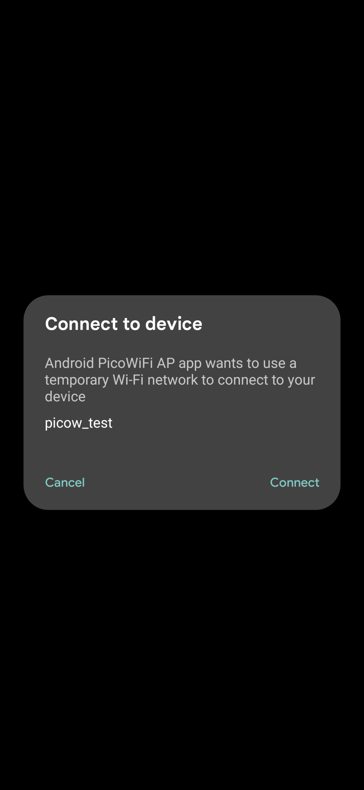
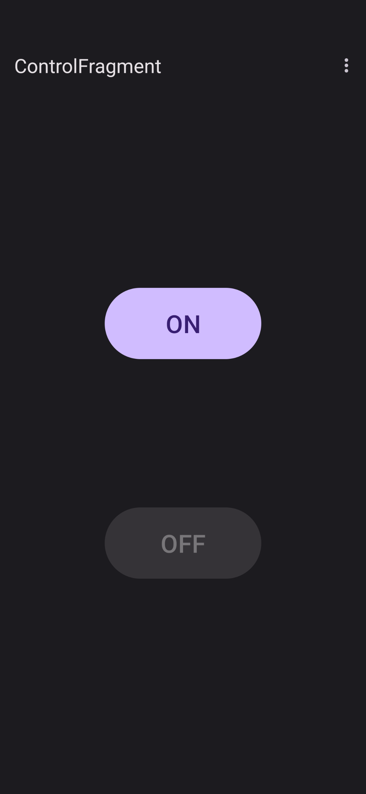

# Android Pico WiFi AP

This is a PoC for an Android app connecting to a WiFi AP and through that access an API via HTTP. 
The AP to connect to shall not provide internet access. The access to the WiFi network 
is limited to the app only, and shall be managed without any unnecessary user interaction.

Please don't take this project as reference for good programming. I simply wanted to know if it
works in general. 

This is meant to be used in conjunction with https://github.com/zero2null/pico-wifi-ap

